# MSI Claw 8 AI+ Nobara Linux Dual Boot Guide

Turn your MSI Claw 8 AI+ into a dual boot handheld — with the Steam Deck experience on Nobara Linux and the ability to run local LLMs with GPU acceleration via llama.cpp, or connect to OpenClaw as your personal AI assistant.

> **⚠️ This guide is for the Claw 8 AI+ (Lunar Lake / Core Ultra 7 258V) specifically.**
> The popular [A1M Reddit guide](https://www.reddit.com/r/MSIClaw/comments/1lnv5m9/) has Meteor Lake-specific BIOS tweaks that **do not apply** to Lunar Lake. Do not blindly copy A1M settings.

## Device Specs

| Component | Detail |
|---|---|
| CPU | Intel Core Ultra 7 258V (Lunar Lake) — 4P + 4E, no HyperThreading |
| GPU | Intel Arc 140V (Xe2 / Battlemage) — 8 Xe2 cores |
| RAM | 32GB LPDDR5x-8533 on-package (not upgradeable) |
| Bandwidth | 136.5 GB/s (quad-channel) |
| Storage | 1TB / 2TB NVMe PCIe 4.0 (M.2 2230, replaceable) |
| WiFi | Killer WiFi 7 BE1750 (Intel BE201) |
| Battery | 80Wh |
| Display | 8" FHD+ 1920x1200, 120Hz, VRR, IPS |
| Target OS | Nobara 43 Steam-Handheld |

## Quick Start

If you just want to get going:

1. Read the [Installation Guide](docs/INSTALL.md) — covers BIOS, partitioning, Ventoy, and dual boot setup
2. Run the [Post-Install Script](scripts/claw8-post-install.sh) — automates controller, WiFi fix, GPU driver, and AI setup with llama.cpp + Vulkan
3. Use [run-model.sh](scripts/run-model.sh) to launch models — auto-discovers GGUF files, configures reasoning and context automatically
4. Follow the [OpenClaw Setup Guide](docs/OPENCLAW_SETUP.md) — full agent installation, skills, security, and three-route configuration
5. Use the [Model Download Scripts](docs/DOWNLOAD_MODELS.md) — fast parallel downloads of safetensors and GGUF models from Hugging Face
6. Check the [Troubleshooting Guide](docs/TROUBLESHOOTING.md) if something goes wrong

```bash
# After first boot into Nobara, download and run:
chmod +x claw8-post-install.sh
sudo bash claw8-post-install.sh
```

## Post-Install Script Versions

Two versions are provided depending on your AI backend preference:

| Script | Backend | GPU Acceleration | When to Use |
|---|---|---|---|
| **claw8-post-install.sh** | llama.cpp + Vulkan | ✅ Yes (~2-3x faster TG) | **Recommended** — best performance on Arc 140V |
| **claw8-post-install-ollama.sh** | Ollama | ❌ CPU-only (for now) | Future use if Ollama adds Intel Vulkan support |

### Why llama.cpp over Ollama?

Ollama bundles a pre-built llama.cpp backend compiled with **CUDA only** (NVIDIA). On Intel iGPUs, it silently falls back to CPU. By building llama.cpp from source with `-DGGML_VULKAN=ON`, the Arc 140V iGPU is used for inference — giving measurably better token generation speed.

Both expose the same OpenAI-compatible API (`/v1/chat/completions`), so OpenClaw and other tools work identically with either backend.

## What the Post-Install Script Does

| Phase | Action | Interactive? |
|---|---|---|
| 1 | System update via `nobara-sync cli` | No |
| 2 | Check GPU driver (xe vs i915), offer switch | Yes (if i915) |
| 3 | Mask InputPlumber, install HHD for controller | No (skips if installed) |
| 4 | WiFi sleep fix (D3Cold + module reload) | No |
| 5 | Disable hibernate (breaks Quick Resume) | No |
| 6 | Build llama.cpp with Vulkan, install model launcher, download GGUF model | Yes (model choice) |
| 7 | Summary and reboot prompt | Yes |

## Model Launcher

The `run-model.sh` script is an interactive launcher that auto-discovers GGUF models in `/shared/models/gguf/`. It is installed automatically by the post-install script, or you can set it up manually:

```bash
# Copy from the repo
cp scripts/run-model.sh ~/run-model.sh
chmod +x ~/run-model.sh
```

```
$ ~/run-model.sh

Available models:
───────────────────────────────────────────────────────────────────────────────
  1) Crow-4B-Opus-4.6-Distill-Heretic_Qwen3.5.Q5_K_M.gguf  [3.0G] reasoning OFF | ctx 8k
  2) GLM-4.7-Flash-Q4_K_M.gguf                              [ 18G] reasoning ON  | ctx 32k
  3) LFM2-24B-A2B-Q5_K_M.gguf                               [ 17G] reasoning ON  | ctx 32k
  4) Qwen3.5-4B-UD-Q4_K_XL.gguf                             [2.8G] reasoning OFF | ctx 8k
  5) Qwen3.5-35B-A3B-UD-Q4_K_XL.gguf                         [ 21G] reasoning ON  | ctx 32k

Select model (1-5):
```

Features:
- Auto-discovers all `.gguf` files in `/shared/models/gguf/`
- Detects model size from filename (falls back to file size estimate)
- Models ≥9B: reasoning ON, 32k context (agentic/tool-calling ready)
- Models <9B: reasoning OFF, 8k context (small models loop in thinking mode)
- Serves OpenAI-compatible API at `http://127.0.0.1:8080`
- Built-in Web UI at `http://127.0.0.1:8080`
- Drop new GGUF files into the model directory — they auto-appear in the menu

## Real-World Benchmarks (Arc 140V + Vulkan)

All benchmarks measured on the Claw 8 AI+ with llama.cpp built with Vulkan, 8 threads, `ngl=99`, using `llama-bench`. Numbers are confirmed across multiple runs.

### Complete Benchmark — All Models, All Context Sizes

| Model | Active | Size | PP @512 | PP @8k | PP @32k | TG |
|-------|--------|------|---------|--------|---------|-----|
| Qwen3.5-4B (dense) | 4B | 2.70 GB | **629** | **445** | **263** | 11.5 |
| **LFM2-24B-A2B** | **2B MoE** | **15.75 GB** | 394 | 232 | 153 | **20.7** |
| Qwen3.5-35B-A3B (Q4_K_XL) | 3B MoE | 20.70 GB | 308 | 200 | 153 | 9.5 |
| Qwen3.5-35B-A3B Uncensored (IQ4_XS) | 3B MoE | 17.36 GB | 300 | 210 | 159 | **13.3** |
| Nemotron-Cascade-2-30B-A3B (IQ4_XS) | 3.5B MoE | 16.73 GB | 312 | 223 | 175 | **16.9** |
| GPT-OSS-20B (F16) | 20B dense | 12.83 GB | 230 | 235 | 91 | 9.5 |
| GLM-4.7-Flash | 3B MoE | 17.05 GB | 304 | 118 | 43 | 11.9 |

### Quantization Impact — Qwen3.5-35B-A3B

| Quant | Size | TG | VRAM headroom | Notes |
|-------|------|-----|---------------|-------|
| Q4_K_XL | 20.7 GB | 9.5 tok/s | ~1 GB (needs `--parallel 1`) | Official quant, best quality |
| IQ4_XS | 17.4 GB | **13.3 tok/s** | ~4 GB (auto parallel) | **+40% TG**, minimal quality loss |

### PP Slowdown from 512 → 32k (Architecture Impact)

| Model | Architecture | Slowdown | Why |
|-------|-------------|----------|-----|
| Qwen3.5-35B | Hybrid SSM + Attention | **2.0x** (best) | Only 1 in 4 layers uses attention |
| Qwen3.5-4B | Hybrid SSM + Attention | 2.4x | Same architecture, less memory pressure |
| LFM2-24B | Hybrid Convolution + 10 GQA | 2.6x | 30 conv + 10 attention layers |
| GLM-4.7-Flash | All Attention (47 layers MLA) | **7.1x** (worst) | Every layer pays quadratic cost |

Hybrid architectures (SSM/convolution + sparse attention) scale dramatically better with context length than all-attention models on memory-constrained hardware.

### Vulkan vs CPU Comparison (Qwen3.5-4B)

| Config | PP (tok/s) | TG (tok/s) |
|---|---|---|
| Vulkan ngl=99, 8 threads | **629** | **11.5** |
| Vulkan ngl=99, 2 threads | 208 | 12.9 |
| CPU only, 8 threads | 421 | 9.2 |
| CPU only, 2 threads | 274 | 5.4 |

Key takeaways:
- Vulkan gives **~40% faster TG** over CPU
- Thread count dramatically affects PP (3x difference) but not TG
- TG is memory-bandwidth bound (136.5 GB/s LPDDR5x); PP is compute-bound

### Performance Tuning (run-model.sh defaults)

The launch script applies these optimizations automatically:

| Flag | Effect | Impact |
|---|---|---|
| `-fa` | Flash attention | Reduces KV cache memory, faster attention at long contexts |
| `-b 4096` | Larger prompt batch size | Better prefill throughput on Vulkan |
| `-ub 1024` | Larger micro-batch | Better GPU utilization during prefill |
| `--mlock` | Lock model in RAM | Prevents swap thrashing on large models |
| `--parallel 1` | Single-slot (MoE only) | Prevents memory pressure on 20GB+ MoE models |

**If PP is still slow on MoE models:** MoE routing on Vulkan has inherent overhead vs CPU. This is a known Vulkan backend limitation — the TG improvement is still worth using GPU. For PP-heavy workloads (long prompts), consider using a dense model like Qwen3.5-4B.

**If TG feels capped at ~10-12 tok/s:** This is the LPDDR5x memory bandwidth ceiling (136.5 GB/s). TG speed is fundamentally limited by how fast weights can be read from memory. Using a smaller quantization (Q4 vs Q5) or a model with fewer active parameters helps.

**Additional tuning to try manually:**
- Lower context (`-c 8192`) if you don't need 32k — PP scales with context length
- Use **Q4_K_M** over Q4_K_XL — Q4_K_M has the most optimized codepath in llama.cpp
- Try `-t 4` (P-cores only) if PP doesn't improve with 8 threads on your workload

### GPU Memory Usage

Total iGPU shared memory: ~23.7 GB (from 32GB system RAM)

| Model | Weight Size | Free After Load | Max Context (GPU) |
|---|---|---|---|
| Qwen3.5-4B (2.7GB) | 3.7 GB | ~19.5 GB | 32k+ easily |
| Qwen3.5-9B (6GB) | ~7 GB | ~16 GB | 32k |
| LFM2-24B MoE (17GB) | ~18 GB | ~5 GB | 8-32k |
| GLM-4.7-Flash MoE (18GB) | 18.0 GB | 5.2 GB | 16-32k |
| Qwen3.5-35B MoE (22GB) | ~23 GB | ~1 GB | 8-32k (use `--parallel 1`) |

## Model Recommendations for OpenClaw

| Model | Architecture | Active | Size | TG | Agent Score | Best For |
|---|---|---|---|---|---|---|
| **Qwen3.5-35B-A3B IQ4_XS ★** | **Hybrid SSM+Attn MoE** | **3B** | **17GB** | **13.3** | **Tau-2: 81.2** | **Best agent model — tool calling, multi-step tasks** |
| Nemotron-Cascade-2-30B IQ4_XS | Hybrid Mamba2+Attn MoE | 3.5B | 17GB | 16.9 | Tau-2: 58.9 | Math/coding competitions, fastest MoE TG |
| LFM2-24B-A2B Q5_K_M | Hybrid Conv+GQA MoE | 2B | 16GB | 20.7 | Poor (26% multi-step) | Fastest TG, but unreliable tool calling |
| Qwen3.5-4B Q4_K_XL | Hybrid SSM+Attn dense | 4B | 3GB | 11.5 | Not tested | Quick tasks, smallest footprint |

**Choosing a model for OpenClaw agent use:**
- **Agent reliability priority:** Qwen3.5-35B IQ4_XS — best at tool calling (Tau-2 Bench 81.2, Terminal Bench 40.5), reliable multi-step execution, all 5 tool tests pass
- **Speed priority:** Nemotron-Cascade-2 at 16.9 tok/s — 27% faster TG, great for math/coding, but 2x worse at agent tasks (Tau-2 58.9)
- **Raw speed (no tools):** LFM2-24B at 20.7 tok/s — fastest but hallucinates tool outputs
- **Offload complex work:** Use Claude API or DGX Spark for heavy reasoning, keep local model for fast dispatch and offline fallback

**GGUF quantization notes:**
- **Q4_K_M** — best balance of quality and speed, most optimized codepath in llama.cpp
- **Q5_K_M** — slightly better quality, ~20% larger, good for smaller models where RAM isn't tight
- **Q4_K_XL** — newer format, less optimized, may have slower TG in some backends
- Always use GGUF format (not GPTQ, AWQ, or EXL2 — those require CUDA/NVIDIA)

## Key Differences from the A1M Guide

| Setting | A1M (Meteor Lake 155H) | Claw 8 AI+ (Lunar Lake 258V) |
|---|---|---|
| CPU topology | Disable LP cores, set 2P+4E | Leave defaults (4P+4E, no HT) |
| HyperThreading | Toggle on/off | Does not exist on Lunar Lake |
| SpeedStep/SpeedShift | Disable SpeedStep | Leave defaults |
| Modern Standby | Disable via secret BIOS | Do not change |
| Secret BIOS unlock | Confirmed (Shift+Ctrl+Alt+F2) | Do not attempt blindly |
| GPU driver | xe optional improvement | xe likely already default |
| WiFi chip | Intel PCH CNVi (8086:7e40) | Intel BE201 (8086:a840) |
| GPU device ID | Meteor Lake Xe-LPG | 8086:64a0 (Xe2 Arc 140V) |

## OpenClaw Three-Route Architecture

OpenClaw on the Claw uses three inference backends, routing tasks by complexity:



| Route | Backend | Speed | Use Case |
|-------|---------|-------|----------|
| Claude API | Sonnet 4.6 via Anthropic API key | Cloud | Primary — complex reasoning, research, tool calling |
| Local llama.cpp | Qwen3.5-35B-A3B via Vulkan on Arc 140V | 13 tok/s | Fallback — offline, when Claude is unavailable |
| DGX Spark | Qwen3.5-122B/Nemotron-120B via vLLM | 26-30 tok/s | Future — heavy inference over the network |

Fallback logic: if Claude returns an error or is rate-limited, tasks automatically route to the local model. Spark can be added as an intermediate tier.

### Multi-Agent Setup

Three agents with different models and purposes, accessible from any channel:

| Agent | Model | Access | Use Case |
|-------|-------|--------|----------|
| **Claw 🦞** | Claude Sonnet 4.6 | TUI, WhatsApp, Telegram | Daily tasks, quick questions, tool calling |
| **Atlas 🏛️** | Claude Opus 4.6 | CLI: `openclaw agent --agent opus` | Financial research, deep analysis, reports |
| **Claude Code** | Claude Opus 4.6 (via CLI) | Delegated by Claw via coding-agent skill | Code review, refactoring, multi-file edits |
| **Local fallback** | Qwen3.5-35B-A3B IQ4_XS | When Claude is unavailable | Offline tasks, 13.3 tok/s |

Cross-agent delegation: Claw can spawn Atlas for research tasks (`sessions_spawn`) and delegate code review to Claude Code via the `coding-agent` skill. Requires `tools.sessions.visibility: "all"` in config.

### Local Setup (llama.cpp on the Claw)

```bash
# Start a model
~/run-model.sh

# Test the API
curl -s http://127.0.0.1:8080/v1/chat/completions \
  -H "Content-Type: application/json" \
  -d '{"messages": [{"role": "user", "content": "Hello!"}], "temperature": 0.7}' \
  | python3 -m json.tool
```

### Remote Setup (DGX Spark cluster)

For detailed setup of vLLM on single or dual DGX Sparks, see [eugr/spark-vllm-docker](https://github.com/eugr/spark-vllm-docker) — the community-maintained Docker configuration for running vLLM on DGX Spark clusters. It handles container building, Ray cluster setup, RDMA/InfiniBand networking, and model downloading.

Quick start with a recipe:

```bash
git clone https://github.com/eugr/spark-vllm-docker.git
cd spark-vllm-docker

# Build and distribute container across cluster
./build-and-copy.sh -c

# Run a recipe (e.g., Qwen3.5-122B on dual Sparks)
./run-recipe.sh Qwen3.5-122B-A10B-FP8 --setup
```

Or manually with tool calling enabled for OpenClaw:

```bash
vllm serve Qwen/Qwen3.5-122B-A10B-FP8 \
  --tensor-parallel 2 \
  --distributed-executor-backend ray \
  --max-model-len 128000 \
  --enable-auto-tool-choice \
  --tool-call-parser qwen3_coder \
  --enable-prefix-caching \
  --load-format fastsafetensors \
  --host 0.0.0.0 --port 8888
```

### OpenClaw Configuration

OpenClaw supports multiple authentication methods for Claude.

**Claude authentication options:**

| Method | Cost | Status | Notes |
|--------|------|--------|-------|
| Anthropic API key | Pay-per-token | ✅ Recommended | ~$3/$15 per M tokens (Sonnet), never expires |
| Claude Max OAuth token | Included in subscription | ⚠️ Unreliable | Tokens expire frequently, client fingerprinting may block |
| OpenAI API key | Pay-per-token | ✅ Works | GPT-4.1 as alternative/fallback |

**Important:** OAuth tokens from Pro/Max subscriptions are officially banned in third-party tools since January 2026. In practice, they work intermittently but get 401/403 errors frequently. **Use an API key for reliable operation.** A token refresh script (`scripts/refresh-claude-token.sh`) is provided for those who want to try the OAuth path anyway.

**Working configuration (Claude primary + local fallback):**

```json
{
  "env": {
    "ANTHROPIC_API_KEY": "sk-ant-api03-YOUR_KEY_HERE"
  },
  "agents": {
    "defaults": {
      "model": {
        "primary": "anthropic/claude-sonnet-4-6",
        "fallbacks": ["local/Qwen3.5-35B-A3B"]
      },
      "models": {
        "anthropic/claude-sonnet-4-6": {
          "params": {
            "cacheRetention": "short"
          }
        }
      }
    }
  },
  "models": {
    "providers": {
      "local": {
        "baseUrl": "http://127.0.0.1:8080/v1",
        "apiKey": "no-key",
        "api": "openai-completions",
        "models": [{
          "id": "Qwen3.5-35B-A3B",
          "contextWindow": 32000,
          "maxTokens": 8192
        }]
      }
    }
  }
}
```

**With OpenAI as additional fallback:**

```json
"env": {
    "ANTHROPIC_API_KEY": "sk-ant-api03-...",
    "OPENAI_API_KEY": "sk-..."
},
"model": {
    "primary": "anthropic/claude-sonnet-4-6",
    "fallbacks": ["openai/gpt-4.1", "local/Qwen3.5-35B-A3B"]
}
```

**Routing behavior:**
- Claude (coral route) handles complex reasoning, architecture, refactoring — falls back to Spark when weekly quota is exhausted
- Spark (blue route) handles routine tasks — tests, formatting, simple features — free and unlimited
- Local llama.cpp (teal route) handles fast dispatch and offline work — no network needed

For full Claude + OpenClaw setup details, see the [official Anthropic provider docs](https://docs.openclaw.ai/providers/anthropic).

For the complete installation walkthrough, skills recommendations, security hardening, auto-start configuration, and agent personality setup, see our [OpenClaw Setup Guide](docs/OPENCLAW_SETUP.md).

Works with llama.cpp, Ollama, vLLM, or any OpenAI-compatible endpoint on your network.

> **Note on NemoClaw:** [NVIDIA NemoClaw](https://github.com/NVIDIA/NemoClaw) is an OpenClaw plugin that adds sandboxed execution via NVIDIA OpenShell. It requires Ubuntu + Docker + NVIDIA GPU, so it's **not applicable** to the MSI Claw (Intel Arc 140V). It may be useful on DGX Spark deployments. See the [comparison in our setup guide](docs/OPENCLAW_SETUP.md#nemoclaw-vs-openclaw).

## BitLocker Warning

Windows 11 on the Claw ships with **BitLocker enabled by default**. When you disable Secure Boot (required for Nobara), BitLocker locks the Windows partition and demands a 48-digit recovery key on every boot.

**Options:**
1. **Decrypt before installing** (recommended) — Settings → Privacy & Security → Device Encryption → Off. Wait for completion, then disable Secure Boot.
2. **Keep BitLocker** — Write down your recovery key (`manage-bde -protectors -get C:` in admin CMD) and accept typing it each time you boot Windows.
3. **Linux only** — If you don't need Windows, Secure Boot + BitLocker are irrelevant.

## Known Issues

| Issue | Status | Workaround |
|---|---|---|
| WiFi dies after sleep | Known Intel iwlwifi bug | D3Cold fix + module reload (script handles this) |
| Sleep/wake hangs | Kernel-level, WIP | Keep kernel updated; avoid hibernate |
| No fan/TDP control (like MSI Center M) | HHD provides partial | Install HHD (script handles this) |
| Ollama doesn't use Intel iGPU | Ollama ships CUDA-only, no Vulkan | Use llama.cpp with Vulkan instead (post-install script handles this) |
| `intel_gpu_top` doesn't work | Only supports i915, not xe driver | Use `nvtop` instead (post-install script installs it) |
| Vulkan PP slower than CPU on large MoE models | Known — MoE routing overhead on Vulkan | TG is still faster with Vulkan; use GPU for generation |
| llama-bench OOM with large models | Default context too large for GPU memory | Add explicit `-c 8192` or lower |
| Small models loop in thinking mode | 4B models waste tokens on bad self-critique | Use `--reasoning-budget 0` (run-model.sh handles this automatically) |
| USB won't boot | Boot order issue | Set USB Hard Disk as Boot Option #1 in BIOS before installing |
| Linux Audio Compatibility missing in BIOS | Claw 8 AI+ may not have this A1M option | Sound should work without it on Lunar Lake |

## Build llama.cpp Manually

If you need to rebuild or didn't use the post-install script:

```bash
# Install dependencies
sudo dnf install cmake gcc gcc-c++ git vulkan-headers vulkan-loader-devel shaderc nvtop

# Clone and build with Vulkan
git clone https://github.com/ggerganov/llama.cpp ~/llama.cpp
cd ~/llama.cpp
cmake -B build -DGGML_VULKAN=ON
cmake --build build --config Release -j$(nproc)

# Set up model directory and launcher
sudo mkdir -p /shared/models/gguf
sudo chown $USER:$USER /shared/models/gguf
cp scripts/run-model.sh ~/run-model.sh
chmod +x ~/run-model.sh

# Download a model (uses parallel download)
scripts/download_model_fast.sh unsloth/Qwen3.5-9B-UD-GGUF --gguf Q4_K_M

# Launch it
~/run-model.sh
```

**Common build issues on Nobara:**
- `Could NOT find Vulkan (missing: glslc)` → Install `shaderc` package
- GPU shows 0% in system monitor → Normal, GNOME doesn't track Vulkan compute. Use `nvtop`
- `warning: no usable GPU found` → Build didn't include Vulkan. Delete `build/` dir and rebuild with `-DGGML_VULKAN=ON`
- Only 2 threads used by default → Always pass `-t 8` for Lunar Lake (4P + 4E cores)
- KV cache eating 8GB+ RAM → Always set explicit `-c` (e.g., `-c 8192`), don't let it default to training context

## Resources

- [Nobara Wiki](https://wiki.nobaraproject.org)
- [Nobara Downloads](https://nobaraproject.org/download.html)
- [llama.cpp](https://github.com/ggerganov/llama.cpp) — local LLM inference with Vulkan GPU support
- [Hugging Face GGUF Models](https://huggingface.co/models?library=gguf) — pre-quantized models ready to use
- [spark-vllm-docker](https://github.com/eugr/spark-vllm-docker) — community Docker setup for vLLM on DGX Spark clusters
- [OpenClaw](https://github.com/openclaw/openclaw) — self-hosted AI agent orchestration
- [OpenClaw Anthropic Provider Docs](https://docs.openclaw.ai/providers/anthropic) — Claude API key and Agent SDK setup
- [winesapOS MSI Claw support](https://github.com/winesapOS/winesapOS)
- [CachyOS Handheld](https://github.com/CachyOS/CachyOS-Handheld) (alternative distro)
- [HHD (Handheld Daemon)](https://github.com/hhd-dev/hhd)
- [Ollama](https://ollama.com) (alternative backend — currently CPU-only on Intel iGPU)
- [MSI Claw A1M Reddit Guide](https://www.reddit.com/r/MSIClaw/comments/1lnv5m9/) (Meteor Lake — use for reference only)
- [ReignOS](https://github.com/reignstudios/ReignOS) (alternative distro born from MSI Claw work)

## Contributing

This guide was built from real installation experience on a Claw 8 AI+ A2VM in March 2026, including hands-on benchmarking of llama.cpp with Vulkan on the Arc 140V iGPU. If you have corrections, improvements, or additional findings, pull requests are welcome.

## License

MIT
